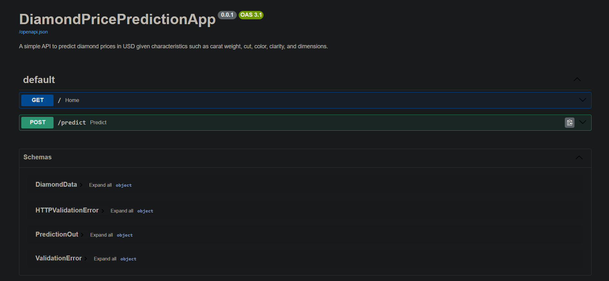
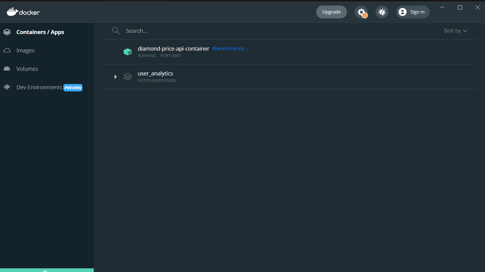
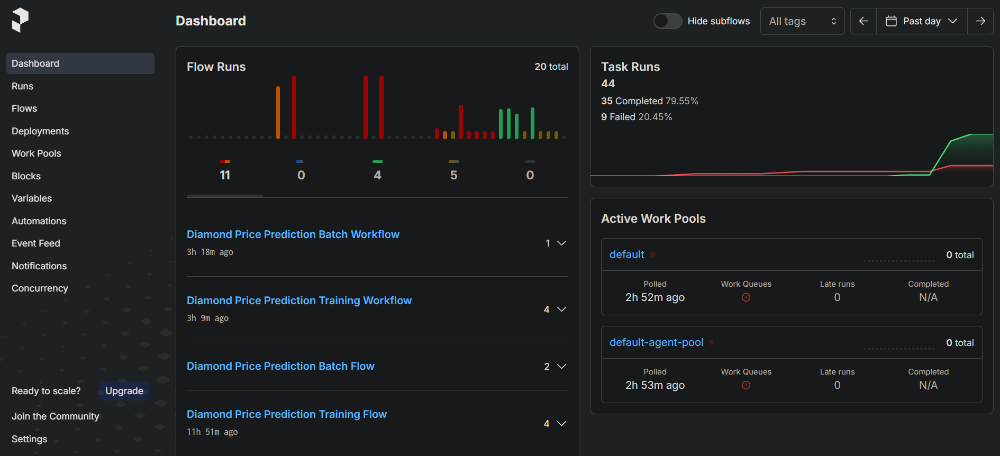
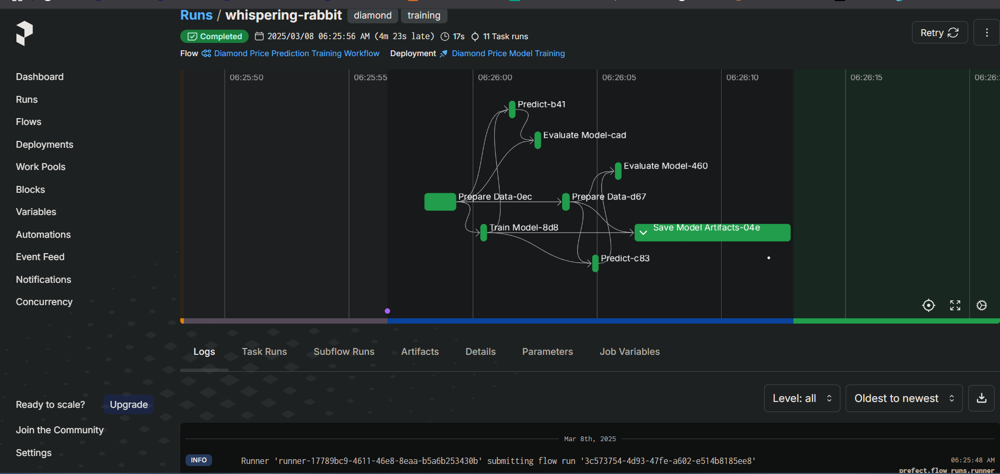
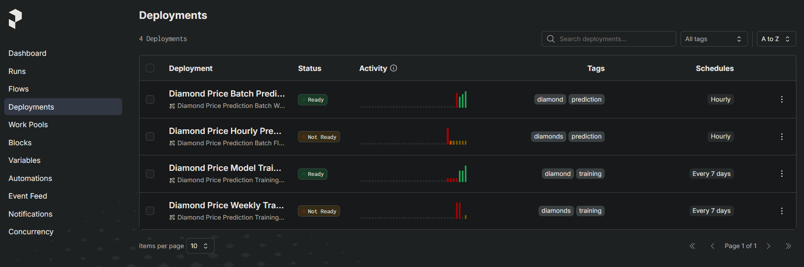

## Project Overview

This project demonstrates a complete Machine Learning Operations (MLOps) pipeline for predicting diamond prices based on their characteristics. The project encompasses the entire MLOps lifecycle, from data preprocessing and model training to deployment and orchestration.

## Dataset Description

The project uses a diamond dataset containing the following features:

- **carat**: Weight of the diamond (0.2-5.01)
- **cut**: Quality of the cut (Fair, Good, Very Good, Premium, Ideal)
- **color**: Diamond color, from J (worst) to D (best)
- **clarity**: Clarity grade (I1, SI2, SI1, VS2, VS1, VVS2, VVS1, IF)
- **depth**: Total depth percentage
- **table**: Width of top of diamond relative to widest point
- **x, y, z**: Length, width, and depth in mm
- **price**: Price in USD (target variable)

## Model Description

The model implemented is a Linear Regression model that predicts diamond prices based on both categorical and numerical features. The model pipeline includes:

1. **Categorical Feature Processing**: One-hot encoding using `DictVectorizer`
2. **Numerical Feature Processing**: Standardization using `StandardScaler`
3. **Model Training**: Linear Regression from scikit-learn
4. **Evaluation Metrics**: RMSE and R² score

## Project Structure

```
diamond-price-prediction/
├── data/                           # Dataset directory
├── models/                         # Saved model artifacts
├── lessons/
│   ├── 01-model-and-experiment-management/  # Experiment tracking
│   │   ├── diamond.py                       # Model training script
│   │   └── diamond.ipynb                    # Training notebook
│   ├── 02-model-deployment/                 # Model deployment
│   │   ├── web_service/                     # FastAPI service
│   │   │   ├── lib/                         # Service modules
│   │   │   ├── main.py                      # API entry point
│   │   │   └── app_config.py                # API configuration
│   │   └── Dockerfile.app                   # Docker container definition
│   └── 03-pipeline-and-orchestration/       # Workflow orchestration
│       ├── lib/                             # Orchestration modules
│       └── orchestration.ipynb              # Prefect workflow examples
└── requirements.txt                         # Project dependencies
```

## Installation

1. Clone the repository:

```bash
git clone https://github.com/rosminanto/esilv-mlops-project
cd diamond-price-prediction
```

1. Create and activate a Python environment (Python 3.10 recommended):

```bash
conda create -n diamond-mlops python=3.10
conda activate diamond-mlops
```

1. Install dependencies:

```bash
pip install -r requirements.txt
```

## Usage

### Model Training and Experiment Tracking

To train the model and track experiments:

```bash
cd lessons/01-model-and-experiment-management
```

Run diamond.ipynb file

This will:

- Load and preprocess the diamond dataset
- Train a Linear Regression model

### Model Deployment

The model is deployed as a REST API using FastAPI. To run the API locally:

```bash
cd lessons/02-model-deployment/web_service
uvicorn main:app --reload
```

Visit `http://localhost:8000/docs` to access the Swagger UI documentation.

 _FastAPI Swagger UI showing the Diamond Price Prediction API endpoints_

#### Docker Deployment

To deploy the API using Docker:

```bash
cd lessons/02-model-deployment
docker build -t diamond-price-api:latest -f Dockerfile.app .
docker run -p 8001:8001 diamond-price-api:latest
```

 _Docker container running the Diamond Price Prediction API_

## API Documentation

The REST API supports the following endpoints:

### GET /

Health check endpoint that returns the API status and model version.

### POST /predict

Predicts the price of a diamond based on its characteristics.

**Request Body:**

```json
{
  "carat": 0.5,
  "cut": "Ideal",
  "color": "E",
  "clarity": "VS1",
  "depth": 61.5,
  "table": 55,
  "x": 5.15,
  "y": 5.2,
  "z": 3.2
}
```

**Response:**

```json
{
  "price_prediction": 693.2683933685362
}
```

### Workflow Orchestration

The project uses Prefect for workflow orchestration. To run the Prefect server:

```bash
prefect config set PREFECT_API_URL=http://127.0.0.1:4200/api
prefect server start --host 127.0.0.1
```

In a separate terminal, run the orchestration script:

```bash
cd lessons/03-pipeline-and-orchestration
python lib/deployment.py
```

Visit `http://localhost:4200/dashboard` to access the Prefect UI.

 _Prefect Dashboard showing workflow overview_

 _Detailed view of a workflow run with task execution graph_

 _Prefect deployments showing training and prediction tasks_

## MLOps Pipeline

The project demonstrates a complete MLOps pipeline:

1. **Data Processing**: Preprocessing and feature engineering
2. **Experiment Tracking**: Using to track experiments, metrics, and models
3. **Model Registry**: Versioning and staging models in MLflow's Model Registry
4. **Model Deployment**: Deploying models as a REST API using FastAPI
5. **Containerization**: Packaging the API in a Docker container
6. **Workflow Orchestration**: Automating the pipeline with Prefect

## Future Improvements

- Implement automated retraining based on data drift detection
- Add monitoring for model performance and predictions
- Extend the model with more advanced algorithms (e.g., XGBoost, Random Forest)
- Implement A/B testing for model deployment
- Add CI/CD pipeline for automated testing and deployment
